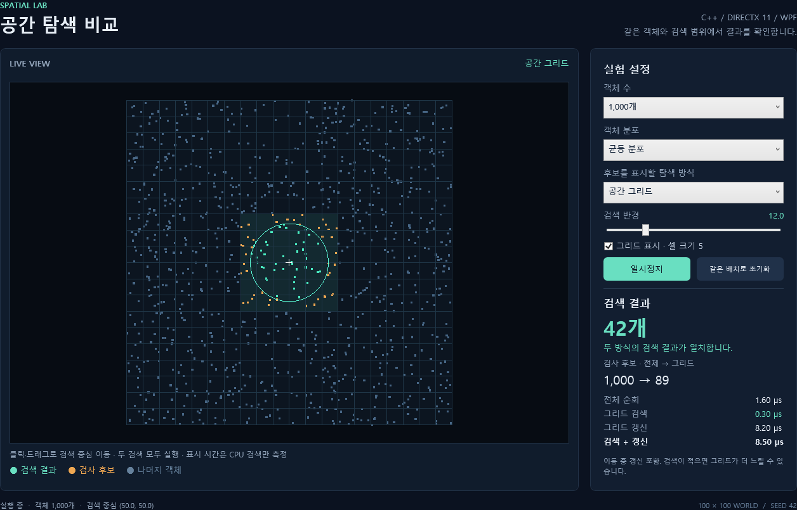

# Spatial Lab — WPF × DirectX11

C++ 공간 검색을 WPF에서 조작하고 DirectX11으로 확인하는 **독립적인 개인 기술 데모**입니다.
움직이는 점 객체에서 전체 순회와 균일 공간 그리드가 같은 결과를 찾는지 확인하고, 후보 수와 CPU 비용을 비교합니다.



## 현재 구현 범위

- WPF 설정 패널과 `HwndHost` 네이티브 뷰포트
- 10 / 100 / 1,000 / 5,000 / 10,000개 객체, 균등 분포 / 중앙 밀집
- 화면 클릭·드래그로 검색 중심 이동, 검색 반경 1~50 조절
- 전체 순회 / 공간 그리드 후보 시각화, 그리드 표시
- 이동 일시정지·재개, 고정 seed 42로 동일 배치 초기화
- 후보와 결과의 색상 구분, 두 방식의 결과 일치 여부 확인
- 검색 CPU 시간과 그리드 갱신 시간 분리
- 창 크기 변경, 최소화·복원, UI 스레드에서 DLL·HWND 수명 관리

이 버전은 **100×100 평면의 점 객체 검색 데모**입니다. 완성된 3D 게임이나 시나리오 편집기는 아닙니다.
3D 모델, 지형, 전투 규칙, DB, 네트워크, 저장·불러오기, Undo/Redo는 포함하지 않습니다.

## 실행

이 PC에서 빌드한 초기 버전은 저장소 루트의 **Run-SpatialLab.cmd**로 실행합니다.

직접 빌드하려면 Windows x64, Visual Studio 2022의 C++ 데스크톱 개발 도구·Windows SDK,
CMake 3.21 이상, **.NET 9 SDK**가 필요합니다. 현재 환경에 설치된 .NET 9과 ATTS에서 사용하는 CommunityToolkit.Mvvm 8.4.0을 사용합니다.

저장소 루트의 PowerShell:

```powershell
.\scripts\build.ps1 -Configuration Release -Test
.\scripts\run.ps1
```

실행 파일과 네이티브 DLL은 `app/SpatialLab/bin/Release/net9.0-windows/`에 생성됩니다.
소스 저장소에는 빌드 결과물을 넣지 않습니다. 실행 폴더를 다른 PC로 옮길 경우 x64 .NET 9 Desktop Runtime과
Visual C++ 런타임이 필요하며, 최초 실행·배포 환경 검증은 별도입니다.

## 사용 방법

1. 객체 수와 분포를 선택합니다. 값이 달라지면 고정 seed로 장면을 다시 생성합니다.
2. 화면을 클릭하거나 드래그해 원의 중심을 옮깁니다.
3. 민트색은 검색 결과, 주황색은 검사한 후보 중 결과에 포함되지 않은 객체입니다.
4. 탐색 방식을 바꾸면 해당 방식의 후보를 표시합니다.
5. 일시정지 후 같은 조건에서 결과와 후보 수를 비교합니다. 초기화는 현재 설정을 유지한 채 배치와 검색 중심을 재설정합니다.

## 측정값 읽기

**실시간 화면은 정확성을 확인하려고 두 검색을 모두 실행합니다.** 선택 메뉴는 후보 시각화를 전환합니다.
따라서 화면 FPS를 두 알고리즘의 성능 차이라고 해석하지 않습니다.

- 전체 순회: 모든 객체를 원과 비교합니다.
- 그리드 검색: 원의 경계 사각형과 겹치는 셀에서 후보를 모은 뒤 원 포함 여부를 확인합니다.
- 그리드 갱신: 이동 중 매 프레임 모든 객체를 셀에 다시 등록하는 비용입니다.
- 검색 + 갱신: 현재 프레임의 단일 그리드 검색과 갱신 비용의 합입니다.
- 검색 시간에는 후보·결과 ID 저장이 포함됩니다. 병렬 작업의 큐 대기·제출·완료 대기 비용은 포함하지 않습니다. 이동, 결과 비교용 정렬, 렌더링, WPF 표시 비용은 제외합니다.
- 화면 수치는 단일 호출 시간이라 흔들릴 수 있습니다. 작은 장면에서는 타이머·호출 오버헤드가 큰 비중을 차지합니다.
- 객체가 적거나, 검색이 드물거나, 객체가 좁은 셀에 몰리거나, 반경이 크면 그리드의 이점이 줄어듭니다.

여러 검색을 같은 스냅샷에서 비교하는 별도 벤치마크:

```powershell
.\out\build\windows-x64\bin\Release\SpatialWorldTests.exe --benchmark
```

[측정 조건과 로컬 결과](docs/06-validation.md)를 참고하세요.
실무 프로젝트에서 보고한 FPS 성과와 이 데모의 측정 결과는 별개입니다.

## 구조

```text
app/SpatialLab/
  Views/                            XAML 바인딩과 창
  ViewModels/                       Toolkit 속성·Command·화면 상태
  Models/                           설정·통계 데이터
  GlobalEnums/                      분포·탐색 방식
  Interfaces/                       ViewModel/뷰포트 서비스 계약
  Services/                         네이티브 서비스 · Interop/에 P/Invoke 분리
  UserControls/                     DirectX HwndHost
  Helpers/                          Win32·미리보기
  Styles/                           공통 리소스
native/SceneRenderer/include/        C ABI v2
native/SceneRenderer/src/
  SpatialWorld.*                    객체 이동, 공간 그리드, 원 범위 검색
  SVRThreadPool.*                   CPU 검색 작업, 완료·예외 전달, worker 종료
  ObjectCommandQueue.*              외부 명령 접수, 버퍼 교환과 소유 스레드 적용
  Renderer.*                        DirectX11 시각화·측정·진단 캡처
  SceneRenderer.cpp                 예외·스레드 검사와 DLL 함수 경계
samples/NativeHost/                  독립적인 네이티브 실행·수명 검증
tests/                              C++ 검증·벤치마크, 독립 ViewModel 검증, WPF 통합 검증
scripts/                            빌드·검증·실행
```

[엔진 호출 흐름과 ATTS 멀티스레드 재사용 검토](docs/08-engine-architecture-and-threading.md)에서 현재 구조와 확장 시 변경할 부분을 확인할 수 있습니다.

ATTS의 역할별 폴더와 Toolkit 패턴을 따른 MVVM 구조입니다. [폴더별 책임과 데이터 흐름](docs/07-mvvm-structure.md)을 참고하세요.

장면 변경과 DirectX 호출은 UI 소유 스레드에서 처리합니다. C++ `SVRThreadPool`의 worker 2개가
1,000개 이상 객체의 전체 순회·그리드 검색을 병렬 실행하고, 프레임은 두 작업이 끝난 뒤 그립니다.
`CompositionTarget.Rendering`에서 DLL을 호출하며 주기적인 통계 발행은 최대 초당 4회입니다. 설정 변경 직후에는 즉시 갱신합니다.
별도의 WPF 렌더 스레드는 만들지 않았습니다. 외부 생산자는 `SR_Enqueue*`로 `ObjectCommandQueue`에
설정·검색 중심·리사이즈를 제출할 수 있고, 렌더러가 프레임 시작 또는 `SR_FlushCommands`에서 반영합니다.
기존 WPF 설정 호출은 동기 API를 유지합니다. [이식 구조와 사용 계약](docs/09-native-threading-port.md)을 참고하세요.

## 검증

`build.ps1 -Test`는 다음을 실행합니다.

- C++ worker의 동시 실행·예외·종료, 명령 큐의 FIFO·용량·값 복사와 병렬 검색 결과 검증
- ViewModel을 WPF·DirectX 없이 검증: Command, 속성 알림, 오류 처리, 구독 해제
- 실제 WPF 양방향 바인딩·Command·통계 표시 및 바인딩 오류 검사
- 셀·월드 경계, 중복 위치, 0 반경, 큰 반경, 무작위 분포와 이동에 대한 검색 정답 비교
- DLL 구조체 크기, 잘못된 입력, 잘못된 스레드 호출, 재설정·캡처·최소화 처리
- WPF 컨트롤 변경이 C++에 전달되는지 확인하고 실제 네이티브 프레임에 도형이 있는지 검사
- WPF 크기 변경·최소화/복원·종료 검증, 앱 자체 화면 캡처

자동 검증 창은 화면 밖에서 실행합니다. 미리보기는 WPF 자체 렌더링과 DirectX backbuffer를 합성한 진단 이미지입니다.
실제 마우스 드래그와 여러 DPI 모니터를 오가는 동작, 장시간 실행은 추가 수동 검증 대상입니다.

## 개발 배경

실무에서 경험한 WPF–C++ 연동과 공간 탐색 문제를 학습용으로 독립 구현했습니다.
ATTS의 작업 큐와 스레드 풀 구조를 현재 엔진에 맞게 이식했습니다. 업무 도메인 로직·모델·DB·업무 데이터·설정 파일은 포함하지 않습니다.
초기 구현과 문서 작성에는 생성형 AI를 활용했으며 빌드와 자동 검증 결과를 함께 기록합니다.
지원 자료에서는 실제 이해·수정·검증한 범위에 맞춰 기여를 설명합니다.

- [MVVM 구조와 폴더별 책임](docs/07-mvvm-structure.md)
- [초기 버전 설계와 기능 범위](docs/05-spatial-lab.md)
- [최초 네이티브 기반 기록](docs/04-engine-foundation.md)
- [이전 장기 계획](docs/02-development-plan.md) — 이 초기 버전보다 넓은 범위의 계획입니다.
