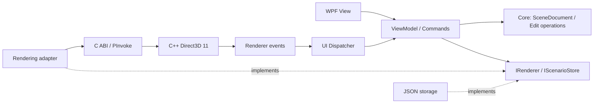

# 포트폴리오 재작성 가이드

작성 기준: 2026-09-05. 아래의 기존 구조는 로컬 소스를 읽고 확인한 사항이며, 새 설계와 목표는 제안입니다. 기존 앱의 실행·성능 검증을 수행한 결과는 아닙니다.

## 1. 포트폴리오에서 보여 줄 것

**“WPF UI와 네이티브 3D 엔진을 연결하고, 사용자의 편집 상태를 일관되게 관리하는 Windows 개발자”**를 중심 메시지로 삼습니다.

작은 3D 시나리오 편집기에서 다음을 실제 동작과 코드로 설명할 수 있어야 합니다.

- MVVM으로 화면·명령·데이터 흐름을 나눈 이유
- C#과 C++ 경계에서 형식, 메모리 수명, 실패를 다루는 방법
- 렌더 스레드와 UI 스레드 사이의 안전한 상태 전달
- 객체 선택·속성 변경·저장·복원의 일관성
- 오류를 재현하고 개선 효과를 측정하는 과정

앱 이름은 임시로 **Scene Editor**, 저장소 이름은 `wpf-directx-portfolio`를 사용합니다. README 첫 화면에 실제 화면, 한 문장 소개, 실행 방법, 대표 기술 문제 3개를 배치하는 것이 최종 목표입니다.

## 2. 기존 프로젝트에서 확인한 구조

아래 경로는 참고 프로젝트 ATTS-TAC 내부의 상대 경로입니다. 새 저장소에는 해당 소스가 들어 있지 않습니다.

| 근거 파일 | 확인한 내용 | 새 프로젝트에 반영할 방향 |
| --- | --- | --- |
| `SVRwpf/WpfApp1.csproj`, `EnginePaths.props` | .NET 8 WPF, x64, CommunityToolkit.Mvvm, 네이티브 vcxproj 참조 | 새 앱은 .NET 10 LTS, x64로 시작하고 빌드 의존성을 문서화 |
| `SVRwpf/UserControls/DirectXHost.cs` | HwndHost, P/Invoke, 렌더 스레드, 네이티브 콜백 | 호스트 수명·ABI·이벤트 변환의 책임을 분리 |
| 동일 파일의 엔진 초기화 함수 선언 | 일부 함수가 C++ 장식된 EntryPoint 이름에 연결됨 | 새 DLL은 `extern "C"` 이름으로 계약 고정 |
| `SVRwpf/Services/DirectXService.cs` | 정적 Instance, DirectXHost 직접 호출, 네트워크 이벤트 연결 | 렌더링 인터페이스를 주입하고 네트워크 의존성을 분리 |
| `SVRwpf/App.xaml.cs`, `Services/ServiceLocator.cs` | DI 등록과 ServiceLocator 사용이 함께 존재 | App에서 조립하고 생성자로 의존성을 전달 |
| `SVRwpf/Models/Scenario.cs`, `SceneObject.cs` | 시나리오·객체·좌표와 JSON 변환 개념 | 작은 장면 모델과 버전이 있는 저장 DTO로 재설계 |
| `SVRwpf/Models/AttsContext.cs`, `Services/DbConnectionSettings.cs` | EF Core/Pomelo와 로컬 INI 설정 | MVP는 로컬 JSON 저장으로 실행 환경 단순화 |
| `0.TMPSVISUAL/SVREngine/SVREngine_x64.vcxproj` | Direct3D 11, C++17 설정, v142/v143 구성, D3DX 의존성 | 새 최소 렌더러는 도구 체인을 통일하고 도형부터 렌더링 |

기존 전체 기능을 옮기는 양보다 **경계를 정리한 근거와 작동하는 결과**가 평가 자료가 됩니다. 이 표는 구조 비교이며, 기존 코드의 모든 동작이나 품질에 대한 판정은 아닙니다.

## 3. MVP 범위

| 우선순위 | 기능 | 완료 기준 |
| --- | --- | --- |
| P0 | WPF 셸과 3D 뷰포트 | 초기화·리사이즈·종료가 정상 동작 |
| P0 | 카메라 | 회전·이동·확대 입력과 UI 포커스 전환 가능 |
| P0 | 객체 배치·선택·삭제 | 장면과 목록이 같은 객체 ID를 유지 |
| P0 | 속성 패널 | 위치·회전·크기 편집, 잘못된 입력 안내 |
| P0 | JSON 저장·불러오기 | 재시작 후 객체·변환·카메라 상태 복원 |
| P1 | Undo/Redo | 배치·삭제·속성 편집을 되돌리고 재실행 |
| P1 | 로딩·오류·진단 | 파일 오류나 렌더러 실패의 원인을 표시 |
| P1 | 배포·데모 | 개발 PC 외 Windows 환경에서 재현 |
| P2 | 경로 편집 또는 간단한 재생 | MVP 완료 후 대표 확장 기능 하나만 선택 |

초기 에셋은 바닥, 큐브, 구 등 직접 만든 도형 3종입니다. 실제 장비·지형 데이터, 복잡한 모의 로직, 사내 프로토콜, 다중 사용자, DB 서버는 초기 범위에서 제외합니다. 기능 확장은 MVP 완료 후 다시 판단합니다.

## 4. 목표 아키텍처



### 프로젝트 참조

- `Core`: UI·DB·P/Invoke 없이 모델과 인터페이스를 정의합니다.
- `Infrastructure`: `Core`를 참조하고 JSON 저장과 설정을 구현합니다.
- `Rendering`: `Core`를 참조하고 HwndHost와 네이티브 연결을 구현합니다. WPF 관련 형식은 이 프로젝트 안에 둡니다.
- `App`: 세 프로젝트를 조립하고 ViewModel에 필요한 인터페이스를 주입합니다.
- `native/SceneRenderer`: 렌더링 DLL입니다. 공개 헤더와 함수 목록을 별도 문서로 관리합니다.

2026-09-06 현재 네이티브 DLL과 빈 화면 샘플의 CMake 프로젝트만 생성했습니다. WPF 및 관리 코드 프로젝트는 이후 M1 작업에서 추가합니다. 현재 구현 범위는 [엔진 골격 문서](04-engine-foundation.md)를 참고하세요.

### 화면 구성

```text
┌ 파일 / 편집 / 보기 ──────────────── 상태·진단 ┐
│ 객체 카탈로그 │                 │ 속성 패널 │
│              │   3D 뷰포트     │ 위치      │
│              │                 │ 회전/크기 │
├ 장면 객체 목록┤                 │           │
└ 선택 상태 ───────────── 오류·저장 상태 ─────┘
```

HwndHost의 자식 HWND는 WPF 콘텐츠와 표시·입력 제약이 있으므로 뷰포트 위에 WPF 패널을 겹치는 설계를 기본으로 삼지 않습니다. 속성·툴바는 옆 영역에 놓고 DPI, 포커스, 팝업 동작을 초기에 검증합니다. 근거: [Microsoft HwndHost 설명](https://learn.microsoft.com/en-us/dotnet/desktop/wpf/advanced/hosting-win32-content-in-wpf).

## 5. 구현 원칙

### 상태와 편집

`SceneDocument`를 저장 가능한 장면의 기준 상태로 삼습니다. UI 선택 상태와 렌더러 내부 핸들은 별도로 관리합니다. 객체에는 안정적인 ID를 부여하고 ID와 네이티브 핸들의 매핑 수명을 명시합니다.

```text
사용자 명령 → 입력 검증 → 편집 작업 → 렌더러 반영 → 성공 후 UI 갱신
렌더러 선택 이벤트 → ID 확인 → UI Dispatcher → 선택 상태 갱신
```

네이티브 반영 실패 시 모델만 변경된 상태가 남지 않도록 성공 응답 전 확정을 미루거나 원복합니다. M2에서 이 정책을 하나 선택해 ADR에 기록합니다. 드래그의 여러 프레임은 Undo 기록 하나로 묶습니다.

### 네이티브 경계

- `extern "C"`, 고정 폭 정수, 호출 규약, 문자열 인코딩을 공개 헤더와 C# 선언에 함께 명시합니다.
- x64로 통일하고 C++ `bool`, 구조체 패딩, 포인터 소유권을 암묵적으로 가정하지 않습니다.
- 예외가 ABI 밖으로 넘어가지 않도록 오류 코드와 진단 메시지로 변환합니다.
- 콜백 delegate를 살아 있게 보관하고 해제 순서를 문서화합니다.
- 렌더링·장면 변경은 한 소유 스레드에서 처리하고 UI 요청은 명령 큐로 전달합니다.
- 종료 순서는 새 요청 중지 → 렌더 루프 종료 확인 → 콜백 해제 → 네이티브 자원 해제 → HWND 정리로 검증합니다.
- DLL 누락·잘못된 아키텍처·초기화 실패를 구분해서 사용자에게 알립니다.

### 저장과 설정

JSON에는 `schemaVersion`, 객체 ID·종류·변환, 카메라 정보를 기록합니다. 절대 경로와 네이티브 포인터는 저장하지 않습니다. 샘플 에셋은 식별자 또는 프로젝트 상대 경로로 참조합니다.

저장 전 검증하고 임시 파일을 거쳐 대상 파일을 교체합니다. 잘못된 JSON이나 지원하지 않는 버전을 열었을 때 현재 장면을 보존합니다. 로컬 설정은 제외된 파일에 두고, 필요한 항목만 가짜 값의 예제 파일로 제공합니다.

### 의존성과 스타일

UI 테마는 WPF 기본 스타일로 시작합니다. 기능상 필요가 확인된 패키지만 추가하고 선택 이유를 적습니다. .NET 10 LTS를 목표로 하며, 실제 SDK·패키지 버전은 M1의 재현 가능한 빌드에서 고정합니다. 지원 현황: [Microsoft .NET 지원 정책](https://dotnet.microsoft.com/en-us/platform/support/policy).

## 6. 기존 코드 활용 방법

기존 코드는 동작·설계 문제를 이해하는 참고 자료로 두고, 기능별 입력과 출력부터 기록합니다. 새 프로젝트에 작은 독립 구현을 만든 뒤 공개 가능한 샘플로 같은 사용자 흐름을 검증합니다.

특정 소스나 에셋을 실제로 가져오는 경우에는 작성 주체·사용 범위·필요한 고지를 확인한 항목만 선별합니다. 원본 Git 이력, 접속 설정, DB 덤프, 업무 문서와 모델 폴더 전체를 새 저장소에 복사하지 않습니다. 이 방식이면 초기 Private 개발 이력을 나중에 공개할 때 정리할 범위도 작아집니다.

## 7. 포트폴리오에 남길 증거

| 주제 | 기록할 자료 |
| --- | --- |
| 설계 | 모듈 경계, 스레드·메모리 수명 다이어그램, 선택 이유 |
| 구현 | 배치·편집·저장 흐름의 짧은 영상과 관련 코드 |
| 문제 해결 | 재현 조건 → 원인 → 수정 → 검증 결과 |
| 품질 | 자동 테스트, 실패 상황, 배포 환경 확인 |
| 성능 | CPU/GPU·해상도·객체 수·빌드·측정 도구를 포함한 수치 |
| 기여 | 기존 프로젝트에서 직접 맡은 부분과 새로 작성한 부분의 구분 |

성능 목표의 예시는 1080p/1,000개 단순 도형에서 60 FPS이며 보장 값이 아닙니다. M1에서 기준 PC와 측정 방법을 정하고 M4에서 실제 결과를 기록합니다. FPS 평균 외에 프레임 시간 p95, 시작·로드 시간, 메모리 추세도 확인합니다.

## 8. 공개 준비 시점

데모·빌드 재현·기여 설명이 갖춰진 뒤 공개 여부를 별도 결정합니다. 공개 전에는 전체 이력과 포함 자료, 에셋 출처, 라이선스를 확인하고 README를 실제 구현 상태에 맞춥니다. 현재 요청 범위는 Private 저장소 구성까지입니다.
