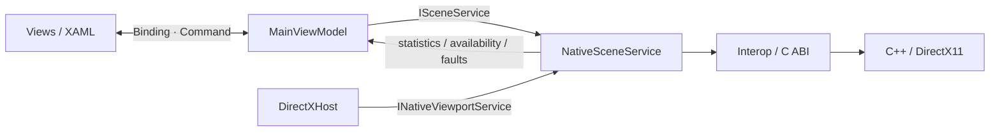

# MVVM 구조 — 2026-09-07

ATTS WPF 프로젝트의 역할별 폴더 구성과 CommunityToolkit.Mvvm 8.4.0 사용 방식을 참고했습니다.
이전 초기 버전은 MainWindow 코드 비하인드에 설정 읽기, DLL 설정 전달, 화면 표시, 렌더링과 검증을 함께 두었습니다.
이번 변경에서 애플리케이션 상태와 동작을 ViewModel로 분리했습니다.

## 폴더

```text
app/SpatialLab/
├─ App.xaml / App.xaml.cs             리소스 등록, 서비스·ViewModel 조립
├─ Views/
│  ├─ MainWindow.xaml                 바인딩·Command·레이아웃
│  └─ MainWindow.xaml.cs              DataContext 연결, 창 종료 시 정리
├─ ViewModels/
│  └─ MainViewModel.cs                설정 상태, Command, 통계 표시, 오류 상태
├─ Models/
│  ├─ SceneSettings.cs                UI/ABI와 독립적인 설정 데이터
│  ├─ SceneStatistics.cs              읽기 전용 통계 스냅샷
│  └─ SelectionOption.cs              선택 항목의 값과 표시명
├─ GlobalEnums/
│  └─ SceneEnums.cs                   분포·탐색 방식
├─ Interfaces/
│  ├─ ISceneService.cs                ViewModel이 사용하는 추상 계약
│  └─ INativeViewportService.cs       네이티브 창·렌더링 기반 계약
├─ Services/
│  ├─ NativeSceneService.cs           렌더러 수명, 설정 변환, 통계 발행
│  └─ Interop/NativeMethods.cs        DLL 선언과 ABI 구조체
├─ UserControls/
│  └─ DirectXHost.cs                  HWND 생성, 크기, 입력, 프레임 요청
├─ Helpers/
│  ├─ NativeWindowMethods.cs          Win32 창 함수
│  └─ ViewportCapture.cs              앱 자체 미리보기 저장
└─ Styles/
   └─ UIStyleResourceDictionary.xaml  공통 스타일과 상태 표시 트리거
```

DB, Network, Managers, Converters, Behaviors 등은 현재 기능에서 사용하지 않아 빈 폴더를 만들지 않았습니다.
프로젝트 파일은 기존 `app/SpatialLab/SpatialLab.csproj`에 그대로 있습니다.
C++ 프로젝트 구조와 ABI v2, 실행 파일 경로는 유지합니다.

## 역할과 흐름



- App은 NativeSceneService 하나를 생성해 MainViewModel과 DirectXHost에 주입합니다.
- MainViewModel은 ObservableObject를 상속하고 ObservableProperty·RelayCommand를 사용합니다.
- ComboBox, Slider, CheckBox는 양방향 바인딩입니다. Pause와 Reset은 ICommand 바인딩입니다.
- 표시 문자열과 Command 사용 가능 여부는 ViewModel의 속성 알림으로 갱신합니다.
- 색상과 레이아웃은 XAML Style·DataTrigger에서 결정합니다.
- ViewModel은 Window, Control, Brush, HWND, DllImport, 네이티브 구조체를 참조하지 않습니다.
- ISceneService는 설정과 이벤트만 노출합니다. HWND·캡처는 별도 INativeViewportService로 분리했습니다.
- Service가 Model과 ABI 구조체를 변환하므로 UI 데이터에 Size·포인터 등의 네이티브 규약이 들어가지 않습니다.

## 코드 비하인드와 HwndHost

MVVM에서도 HWND 생성·삭제, 실제 픽셀 크기, Win32 마우스 메시지, CompositionTarget.Rendering은
View 기반의 책임입니다. 이 코드는 DirectXHost에 남깁니다.
MainWindow 코드 비하인드는 DataContext와 서비스 연결, 종료 시 View와 ViewModel 정리만 담당합니다.

Service는 생성 스레드에서만 호출하며, 주기적인 통계 발행을 초당 최대 4회로 제한합니다.
설정 적용 직후와 진단 검증의 강제 갱신은 즉시 통계를 발행합니다.
렌더러 해제는 자식 HWND 파괴보다 먼저 수행합니다.
DirectXHost는 Unloaded/종료 시 정적 Rendering 이벤트를 해제하고,
ViewModel은 Dispose에서 서비스 이벤트 구독을 해제합니다.

## 테스트

- `tests/SpatialLab.ViewModelTests/`: 실제 ViewModel·Model·인터페이스 소스를 링크해 WPF 없는 net9.0 실행 파일로 검증합니다.
  가짜 ISceneService로 초기화 전 설정, Command 활성화, 설정 보존, 통계와 종속 속성 알림,
  네이티브 오류 후 Command 차단, 재연결, 구독 해제를 확인합니다.
- `tests/SpatialLab.SmokeTests/WpfSmokeTests.cs`: 실제 WPF 바인딩과 DLL을 사용하는 통합 검증입니다.
  진단 실행을 위해 앱에 링크되며 일반 실행에서는 호출하지 않습니다.
  바인딩 오류 Trace를 검사하고, 양방향 설정과 Command, 통계 표시, 창 수명·미리보기를 확인합니다.
- 기존 C++ 테스트와 벤치마크는 그대로 사용합니다.

```powershell
.\scripts\build.ps1 -Configuration Release -Test
.\scripts\build.ps1 -Configuration Debug -Test
```

MVVM 분리 자체가 성능 개선을 의미하지 않습니다. 기존 측정 결과는 C++ 검색 알고리즘의 결과이며,
이번 변경은 역할 분리와 독립 검증 가능성을 개선합니다.

C++ 엔진에는 이후 ObjectCommandQueue와 SVRThreadPool을 추가했습니다. 서비스의 UI 스레드 계약은 유지되며,
CPU 검색만 worker가 처리합니다. [네이티브 스레딩 구조](09-native-threading-port.md)를 참고하세요.
