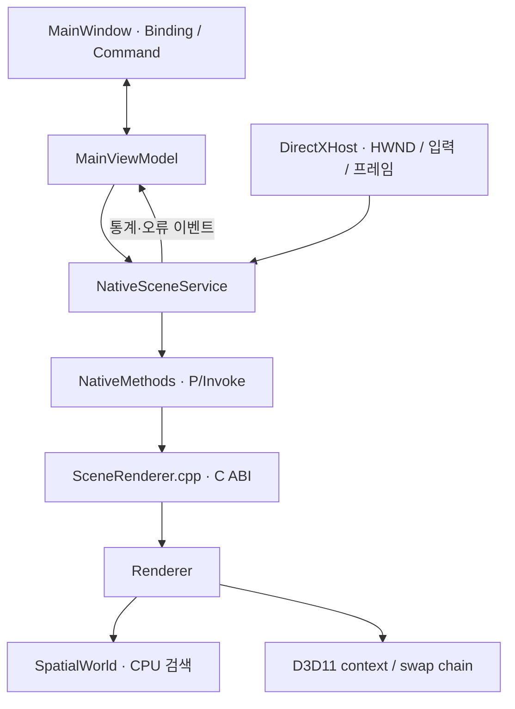
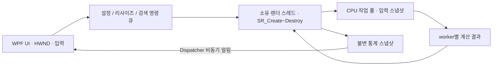

> 이 문서는 이식 전 구조 검토 기록입니다. 후속 구현과 검증은 [네이티브 스레딩 이식](09-native-threading-port.md)을 참고하세요.

# 엔진 구조와 멀티스레드 재사용 검토

검토일: 2026-09-07. 현재 D:\WPF 소스와 로컬 ATTS 참고 소스를 읽고 비교한 결과입니다.
ATTS 원본은 수정하거나 복사하지 않았습니다. 이번 변경은 SpatialLab 이름 정리와 기능 주석 추가이며,
멀티스레드 실행은 아직 도입하지 않았습니다.

## 현재 엔진은 무엇을 하는가

SpatialLab은 100×100 평면에서 움직이는 점 객체를 원 범위로 검색하고,
전체 순회와 공간 그리드가 같은 결과를 반환하는지 Direct3D 11로 보여주는 WPF 앱입니다.
범용 3D 엔진의 모델·카메라·재질 계층은 아직 없습니다.

| 계층 | 읽을 파일 | 책임 |
| --- | --- | --- |
| 앱 시작 | app/SpatialLab/App.xaml.cs | 서비스와 ViewModel 생성, 창 연결, 종료와 진단 실행 |
| 화면 | Views/MainWindow.xaml | 바인딩과 명령으로 설정·통계를 표시 |
| 화면 상태 | ViewModels/MainViewModel.cs | 설정 검증, 일시정지·초기화 명령, 통계 표시와 오류 상태 |
| 창 호스트 | UserControls/DirectXHost.cs | HWND 생성·삭제, 픽셀 크기, 클릭·드래그, 프레임 요청 |
| 연동 서비스 | Services/NativeSceneService.cs | 핸들 수명, UI 모델↔ABI 구조체 변환, 통계 이벤트 |
| DLL 선언 | Services/Interop/NativeMethods.cs | 고정된 C 함수 이름과 cdecl P/Invoke |
| 네이티브 경계 | native/SceneRenderer/include/SceneRenderer.h, src/SceneRenderer.cpp | ABI v2, 핸들·스레드 검사, 예외를 HRESULT로 변환 |
| 렌더러 | native/SceneRenderer/src/Renderer.* | D3D11 자원, 장면 갱신과 검색 계측, 그리기와 픽셀 캡처 |
| 공간 검색 | native/SceneRenderer/src/SpatialWorld.* | 객체 이동, 그리드 재구성, 전체 순회·그리드 원 범위 검색 |

표의 Views부터 Services까지는 app/SpatialLab 아래의 상대 경로입니다.

### 한 프레임의 흐름

1. WPF의 CompositionTarget.Rendering 이벤트가 UI 스레드에서 DirectXHost.RenderFrame을 호출합니다.
2. 같은 프레임의 중복 요청, 숨김·최소화·오류 상태를 거르고 실제 픽셀 크기를 맞춥니다.
3. NativeSceneService.Render가 SR_Render를 호출합니다.
4. Renderer.Update가 이동 → 그리드 갱신 → 전체 순회 → 그리드 검색 → 정답 비교를 수행합니다.
5. DrawScene이 점·격자·검색 원을 정점으로 만들고 GPU에 보냅니다. Present가 화면을 표시합니다.
6. 서비스가 SR_GetStats로 통계를 읽고 일반 실행에서는 초당 최대 4회 ViewModel에 알립니다.

탐색 방식 메뉴는 후보의 표시 방식을 선택합니다. 현재는 정확성 비교를 위해 두 검색을 모두 실행합니다.
검색 CPU 시간, 그리드 갱신 시간과 그리기 비용은 구분해야 합니다.

### 설정·입력·종료

- 설정: XAML 바인딩 → MainViewModel의 변경 훅 → SceneSettings → 서비스 → SR_Configure.
- 클릭·드래그: Win32 마우스 메시지 → 정규화 화면 좌표 → SR_SetQuery → 월드 좌표.
- 종료: Rendering 구독 해제 → SR_Destroy → 자식 HWND 파괴 → ViewModel 구독 정리.
- NativeSceneService.VerifyAccess와 네이티브 Invoke 모두 생성 스레드에서의 접근만 허용합니다.
- SpatialWorld는 렌더러 없이 테스트할 수 있지만 내부 배열을 동시 수정하도록 설계된 클래스는 아닙니다.

## 이름 변경

화면과 실행 진입점에서 사용하던 Spatial Lab 이름에 맞췄습니다.

| 이전 | 현재 |
| --- | --- |
| app/SpatialDemo/SpatialDemo.csproj | app/SpatialLab/SpatialLab.csproj |
| SpatialDemo 네임스페이스·어셈블리 | SpatialLab |
| tests/SpatialDemo.ViewModelTests | tests/SpatialLab.ViewModelTests |
| tests/SpatialDemo.SmokeTests | tests/SpatialLab.SmokeTests |
| docs/05-spatial-demo.md | docs/05-spatial-lab.md |

XAML의 x:Class·clr-namespace, 앱 manifest, 테스트의 소스 링크, 빌드·실행 스크립트와 문서 참조도 함께 변경합니다.
네이티브 DLL 이름 SceneRenderer와 C ABI v2는 유지합니다.

## ATTS 멀티스레드 코드를 그대로 넣을 수 있는가

**일부 구조는 재사용할 수 있지만 현재 코드에 수정 없이 붙일 수는 없습니다.**
아래는 읽은 소스에 근거한 정적 검토이며, ATTS 앱의 실행 오류나 성능을 재현한 결과가 아닙니다.

| 참고 코드 (ATTS-TAC 기준) | 활용 가능한 부분 | 이식 전에 필요한 변경 |
| --- | --- | --- |
| 0.TMPSVISUAL/SVREngine/SVRThreadPool.h·cpp | std::thread, mutex, condition_variable, 작업 큐 | 표준 헤더 직접 포함, stdafx·로그 의존성 제거, 정지·예외·생성 실패 처리 |
| Include/ThreadManager.h, ThreadManager.cpp | 장기 작업의 중지 플래그와 join 관리 | 작업 함수 예외 처리, 대기 작업을 깨우는 종료 정책, 새 엔진에 필요한 최소 API로 축소 |
| Include/ObjectCommandQueue.h, ObjectCommandQueue.cpp | enqueue 잠금과 swap을 통한 일괄 인출 | ATTS 객체 명령·SVRDefine 의존성을 SpatialLab 설정·입력·리사이즈 명령으로 교체 |
| SVRwpf/UserControls/DirectXHost.cs | UI와 렌더 루프를 나누는 방식 | 렌더러의 생성·사용·해제를 같은 작업 스레드로 이동하고 비동기 종료 연결 |
| VisualApp.cpp의 m_simThreadPool 작업 제출 | 계산 작업 분할, 완료 수와 세대 번호 | AI 객체·그룹 상태·지형 등 도메인 의존성 제거, 입력 스냅샷과 결과 적용 경계 확립 |

### 그대로 가져오면 문제가 되는 지점

1. **호출 스레드 계약이 다릅니다.** ATTS 호스트는 UI에서 CreateApp/InitApp을 호출한 뒤 별도 Thread에서 RenderApp을 실행합니다.
   현재 엔진에 이 순서를 그대로 적용하면 서비스 접근 검사 또는 RPC_E_WRONG_THREAD에 걸립니다.
   검사를 삭제하는 대신 새 소유 스레드에서 SR_Create부터 SR_Destroy까지 수행해야 합니다.

2. **원본 호스트의 종료 연결을 보완해야 합니다.** 확인한 DestroyWindowCore와 new Dispose는 렌더 핸들을 0으로 바꾸고 이벤트를 정리하지만
   StopRenderThread 호출이 없습니다. StopRenderThread의 Join(1000)도 반환값을 확인하지 않습니다.
   이 경로를 그대로 복사하면 스레드가 끝나기 전에 핸들·창 수명을 종료할 수 있습니다.
   종료 요청, 실제 렌더 루프 완료, GPU 해제, HWND 파괴를 순서대로 연결해야 합니다.

3. **스레드 풀은 독립 모듈로 정리해야 합니다.** 헤더는 vector·condition_variable·atomic을 직접 포함하지 않고,
   구현은 stdafx.h와 SvrDebug 로그에 의존합니다. WorkerLoop의 job()에는 공통 예외 경계가 없습니다.
   실제 AI 작업에는 별도 try/catch가 있지만 새 작업도 모두 그렇다고 가정할 수는 없습니다.

4. **스레드 풀 종료·생성 실패 경로가 필요합니다.** 종료 후 작업 접수를 막는 검사와 작업 수 0 처리가 없고,
   일부 worker 생성 후 다음 스레드 생성이 실패했을 때 이미 생성한 worker를 정리하는 경로도 필요합니다.
   종료 플래그는 condition_variable의 대기 조건을 보호하는 mutex와 함께 갱신하도록 정리해야
   조건 검사와 실제 대기 사이에 종료 알림을 놓치는 경로를 피할 수 있습니다.

5. **시간 초과는 실행 중 작업을 멈추지 않습니다.** VisualApp의 30ms 대기와 세대 번호는 작업 완료 기록을 관리합니다.
   세대가 바뀌어도 이미 실행 중인 pAI->Update 자체가 자동 취소되는 것은 아닙니다.
   새 엔진에서는 작업이 읽는 배열의 수명과 결과를 적용할 프레임을 따로 보장해야 합니다.

6. **그리드 배열을 여러 worker가 바로 쓰면 안 됩니다.** 현재 Rebuild는 공유 셀의 vector에 push_back합니다.
   병렬화할 때는 worker별 임시 셀을 만든 후 합치거나, 소유 범위를 분리해야 합니다.
   Move/Reset/Rebuild와 Query를 같은 배열에서 동시에 실행하는 것도 피해야 합니다.

### 현재 프로젝트에 적용할 순서 제안

먼저 CPU 작업용 풀을 작은 독립 모듈로 정리하는 편이 변경 범위가 작습니다.

- UI와 DirectX 호출은 현재 소유 스레드에 유지합니다.
- worker에는 복사한 위치·설정처럼 수명이 보장된 입력을 전달합니다.
- worker별 결과 버퍼를 사용하고, 완료된 결과만 소유 스레드에서 적용합니다.
- 완료 전 원본 배열을 변경하거나 작업이 참조하는 데이터를 해제하지 않습니다.
- UI에서 장시간 완료 대기를 하지 않고 이전 완료 프레임을 표시하는 방식도 검토합니다.

현재 1만 개 이하 점 검색에서 병렬화가 더 빠르다는 보장은 없습니다.
작업을 큐에 넣고 결과를 합치는 비용까지 포함해 기존 단일 스레드와 같은 입력으로 비교해야 합니다.

별도 렌더 스레드가 필요하다면 다음 단계로 진행합니다.

GPU immediate context와 Present·Resize는 하나의 렌더 스레드가 담당합니다.
WPF에는 비동기 통계 알림을 보내고, UI와 렌더 스레드가 서로 동기 대기하지 않도록 종료를 설계합니다.
작업 제출 중지 → worker 완료 → 렌더러 해제 → 완료 알림 → UI에서 HWND 파괴 순서를 검증해야 합니다.

관련 계약은 Microsoft의 [D3D11 멀티스레딩 설명](https://learn.microsoft.com/en-us/windows/win32/direct3d11/overviews-direct3d-11-render-multi-thread-intro),
[DXGI와 메시지 루프의 교착 주의사항](https://learn.microsoft.com/en-us/windows/win32/direct3darticles/dxgi-best-practices),
[Thread.Join 시간 제한 반환값](https://learn.microsoft.com/en-us/dotnet/api/system.threading.thread.join?view=net-9.0)을 참고했습니다.

## 이번 변경 검증

이름과 주석만 변경했으며, 변경 전후 C++/C#/XAML 소스 28개를 비교해 실행 로직이 유지됨을 확인했습니다.

| 검증 | Release | Debug |
| --- | --- | --- |
| 네이티브 DLL·샘플·WPF 빌드 | 통과 | 통과 |
| ViewModel 검증 | 18개 통과 | 18개 통과 |
| C++ 검색·ABI·수명주기 테스트 | 3개 통과 | 3개 통과 |
| WPF 바인딩·입력 전달·통계·리사이즈·최소화/복원·캡처·종료 | 통과 | 통과 |

실행 명령은 scripts/build.ps1 -Configuration Release -Test 및 Debug -Test입니다.
멀티스레드 관련 평가는 이식 코드의 실행 검증이 아닌 원본과 현재 구조의 비교입니다.

Visual Studio가 사용 중인 .vs 캐시는 이동하지 못해 이전 app/SpatialDemo 경로에 남겨두었습니다.
이 경로에는 앱 소스나 프로젝트 파일이 없으며, 새 프로젝트는 app/SpatialLab/SpatialLab.csproj입니다.
이름 변경 전 bin/obj는 out/rename-backup 아래에 보관했고 새 경로에서 두 구성을 다시 빌드했습니다.
