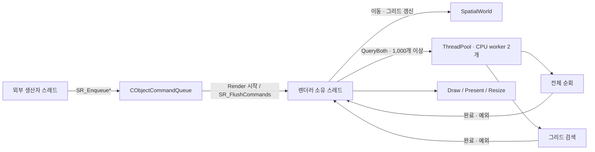

# ObjectCommandQueue · SVRThreadPool 이식

ATTS의 작업 큐·worker loop·명령 버퍼 교환 구조를 현재 C++ 엔진에 맞게 분리했습니다.
ATTS 원본과 WPF 소스는 수정하지 않으며, 기존 SceneRenderer ABI v2 함수·구조체를 유지합니다.

## 실행 구조



현재 렌더러 소유 스레드는 WPF UI 스레드입니다. 별도의 WPF 렌더 스레드는 만들지 않았습니다.
C++ worker는 공간 검색 계산만 수행하며, GPU와 WPF 객체를 사용하지 않습니다.

## 원본에서 유지·변경한 부분

| 모듈 | 유지한 방식 | 현재 엔진에 맞춘 변경 |
| --- | --- | --- |
| SVRThreadPool | worker 배열, mutex, 작업 큐, condition_variable, join | 표준 헤더 직접 포함, future로 예외 전달, 정지 후 제출 거절, 부분 생성 실패 시 정리 |
| ObjectCommandQueue | enqueue 잠금, vector swap으로 일괄 인출 | Configure/Query/Resize 값 명령, 초기화·종료 접수 상태, 최대 4,096개 대기 제한 |

기존 stdafx, SvrDebug 로그, SVRDefine, 업무 객체·지형·그룹 명령 의존성은 포함하지 않습니다.
ThreadPool과 CObjectCommandQueue 이름은 유지하되 scene 네임스페이스 안에 둡니다.

## 명령 큐 계약

새로 추가한 C 함수는 다음과 같습니다.

| 함수 | 호출 스레드 | 의미 |
| --- | --- | --- |
| SR_EnqueueConfigure | 생산자 어느 스레드에서나 | 설정과 초기화 여부를 값으로 복사해 접수 |
| SR_EnqueueQuery | 생산자 어느 스레드에서나 | 검색 중심의 정규화 화면 좌표 접수 |
| SR_EnqueueResize | 생산자 어느 스레드에서나 | 실제 픽셀 크기 접수 |
| SR_FlushCommands | 렌더러 생성 스레드 | 인출한 한 배치를 적용하고 검색 통계를 최신 상태로 갱신 |

- 초기화가 성공한 후 접수가 열립니다. 초기화 전에는 E_UNEXPECTED를 반환합니다.
- Enqueue의 S_OK는 접수 성공이며 적용 완료가 아닙니다. 입력 포인터를 보관하지 않습니다.
- 값 검증 실패는 E_INVALIDARG, 대기 버퍼 포화는 HRESULT_FROM_WIN32(ERROR_NOT_ENOUGH_QUOTA)입니다.
- 한 mutex에서 확정된 접수 순서대로 처리합니다. 여러 생산자의 동시 제출에는 실행 시점에 따라 순서가 결정됩니다.
- Render 시작 시 명령을 먼저 적용하므로 최소화 중의 복원 명령도 처리할 수 있습니다.
- GetStats와 CopyFrame은 명령 큐를 비우지 않습니다. 반영된 결과가 필요하면 먼저 Flush합니다.
- SR_Configure/SetQuery/Resize는 기존 동기 동작을 유지합니다. 큐와 섞어 쓸 때 순서가 중요하면 먼저 Flush합니다.
- 처리 중 실패한 명령은 소비하고, 아직 실행하지 않은 후속 명령은 다음 Flush/Render에서 재개합니다.
- 한 번 인출한 배치가 처리되는 동안 새로 접수한 명령은 다음 배치로 넘어갑니다.
- 대기 버퍼는 최대 4,096개이며 별도로 인출한 처리 버퍼도 보관할 수 있습니다.
- Destroy는 남은 명령을 취소합니다. 호출자는 모든 생산자를 먼저 중지하고 join해야 합니다.
  해제와 Enqueue의 동시 실행, 이미 해제된 핸들의 사용은 지원하지 않습니다.

예를 들어 백그라운드 계산이 완료되면 SR_EnqueueQuery로 결과를 제출하고,
소유 스레드가 다음 SR_Render에서 적용할 수 있습니다.
SR_GetApiVersion은 2를 유지합니다. 새 export가 없는 오래된 DLL에서는 SR_Enqueue*를 사용할 수 없으므로
이 확장 API를 사용하는 호스트는 새 DLL을 함께 배포해야 합니다.

## CPU 스레드 풀과 데이터 수명

SpatialWorld::QueryBoth가 두 검색을 담당합니다.

- 객체가 1,000개 미만이거나 풀이 없으면 기존처럼 순서대로 실행합니다.
- 1,000개 이상이면 전체 순회와 그리드 검색을 worker에 각각 제출합니다.
- 두 작업은 동일한 읽기 전용 월드를 사용하며 서로 다른 결과 버퍼에 씁니다.
- 소유 스레드는 두 작업이 끝나기 전에는 월드를 이동·초기화·재구성하지 않습니다.
- 두 번째 제출이 실패해도 첫 번째 작업을 기다립니다.
- 한 작업이 예외를 던져도 다른 작업의 완료를 확인한 뒤 예외를 C ABI의 HRESULT로 전달합니다.
- 같은 풀의 worker가 다시 QueryBoth를 제출하고 기다리는 중첩 호출은 거절합니다.

현재의 두 작업은 한 프레임 안에서 완료를 기다리는 구조입니다. UI가 완전히 비동기로 동작하거나
worker가 다음 프레임까지 독립적으로 실행되는 구조는 아닙니다.
Move와 Rebuild는 소유 스레드에서 순서대로 처리합니다. 공유 셀 vector를 병렬 push_back하지 않습니다.

ThreadPool::Shutdown은 접수를 닫고 모든 기접수 작업을 마친 뒤 worker를 join합니다.
실행 중인 사용자 함수를 강제로 중단하지 않으므로 작업은 유한 시간 안에 종료해야 합니다.
pool을 자신의 worker에서 파괴하거나 Shutdown하는 사용은 금지합니다.
Renderer는 명령 접수 중지 → CPU worker 종료 → GPU 자원 해제 순서로 정리합니다.

## 측정값 해석

linear_ms와 grid_ms는 각 검색 함수 내부의 실행 시간입니다.
작업 큐 대기·작업 제출·future 완료 대기 비용은 포함하지 않습니다.
이 두 값을 합쳐 프레임 지연이나 병렬화 성능 향상으로 해석하면 안 됩니다.

1,000개 기준과 worker 2개는 초기 구현 정책이며 성능 최적값으로 측정한 결과가 아닙니다.
기존 벤치마크는 단일 스레드 알고리즘 비교를 유지합니다. 병렬화의 개선 효과는 별도로 측정해야 합니다.

## 검증

- NativeThreading: 두 worker의 동시 실행, 작업 예외 후 재사용, 빈 작업·0 worker 거절,
  자기 풀 종료·중첩 대기 거절, 종료 중 제출, 대기 큐 종료, 명령 FIFO·용량·값 복사·취소.
- ParallelQueries: 0/10/999/1,000/10,000개, 두 분포, 이동·월드 경계·0/큰 반경에서 단일 실행과 결과 비교.
- RendererAbiLifecycle: 생산자 Enqueue 성공, 생산자의 직접 장면 접근과 Flush 거절,
  명령의 프레임 적용, 최소화·복원, 초기화 전·잘못된 입력·큐 포화와 기존 캡처.
- 기존 검색 정확성, WPF 바인딩·명령·통계·리사이즈·최소화/복원·캡처·종료 검증 유지.

2026-09-07 포트폴리오 프로젝트에 적용하고 다음 전체 검증을 완료했습니다.

| 실제 프로젝트 검증 | Release | Debug |
| --- | --- | --- |
| C++ DLL·네이티브 샘플·WPF 빌드 | 통과 | 통과 |
| SpatialWorldCorrectness / RendererAbiLifecycle / NativeLifecycle / NativeThreading | 4개 통과 | 4개 통과 |
| ViewModel 설정·명령·알림·오류·수명 검증 | 18개 통과 | 18개 통과 |
| WPF 바인딩·입력 전달·통계·리사이즈·최소화/복원·캡처·종료 | 통과 | 통과 |

실행 명령:

```powershell
.\scripts\build.ps1 -Configuration Release -Test
.\scripts\build.ps1 -Configuration Debug -Test
```

적용 전에는 별도 임시 빌드와 기존 WPF 실행 파일 복사본에서도 호환성을 확인했습니다.
성능 향상 수치, 장시간 부하와 여러 DPI 환경은 이번 결과에 포함하지 않습니다.
